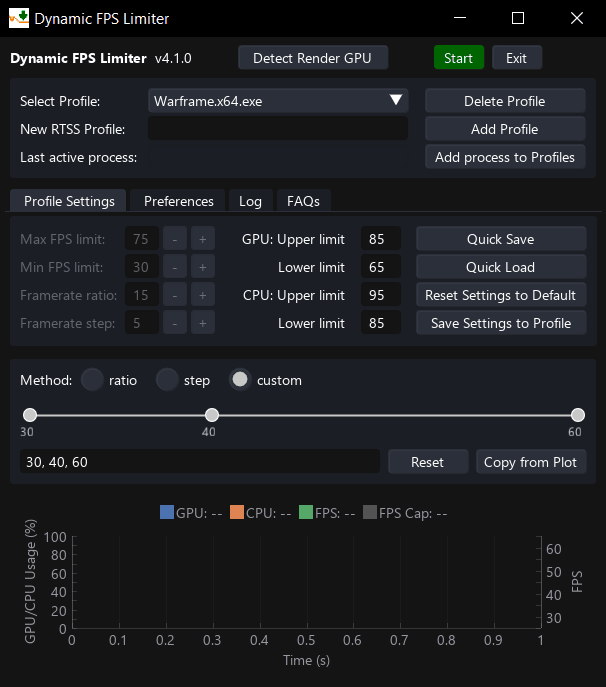
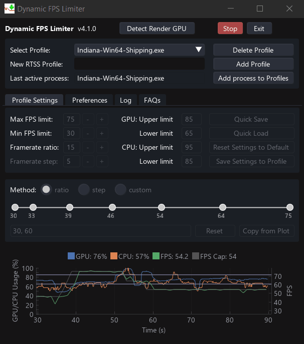

# Dynamic FPS Limiter v4.4

A lightweight companion app for RTSS that uses it's profile modification API to dynamically adjust framerate limits based on real-time GPU and CPU usage. 
- Instead of relying on a fixed FPS cap below average framerates for smooth gameplay, it intelligently raises the cap when performance headroom is available, allowing consistently smooth frametimes, with the caveat of a momentary stutter during FPS limit transition.
- Especially useful for reducing input latency when using frame generation tools like Lossless Scaling, by ensuring there's always enough GPU headroom.
- When paired with adaptive frame generation in Lossless Scaling, it enables a constant high refresh rate experience with lower power draw and reduced GPU temperatures, without noticeable visual compromises or input lag.

  
  &nbsp;
  

## Installation

### To Build It Yourself,
If you'd like to inspect or customize the source code, follow the instructions in [BUILD.md](/src/BUILD.md)

### To Use Prebuilt Executable,
1. Download the `DynamicFPSLimiter_vX.X.X.zip` file from the latest release [here.](https://github.com/SameSalamander5710/DynamicFPSLimiter/releases)
2. Extract the zip file to a desired location
3. Run `DynamicFPSLimiter.exe`  as Administrator.
4. **Recommended**: Add `DynamicFPSLimiter.exe`as an exclusion in RTSS to reduce the app's CPU performance overhead. 
    - This can be done by holding the **Shift** key and clicking **Add** in RTSS, while the app is running.
    - **Note**: While not strictly necessary, this step is strongly recommended if you have disabled 'passive waiting' for the Global profile in RTSS

Watch the demo here! (Based on v4.2.0)

> [!NOTE]
> - This app requires Rivatuner Statistics Server (RTSS) running in the background to function. Ensure RTSS is installed before running the app!
> - Since RTSS runs with elevated privileges, DynamicFPSLimiter must also be run as Administrator to function fully.

> [!CAUTION]
> - The executable in the release was packaged using PyInstaller and may be flagged by some antivirus software as a Trojan. Updating to the [latest version](https://www.microsoft.com/en-us/wdsi/defenderupdates) of Windows Defender should prevent false detections. 
> - You can confirm whether the app is signed by me using the public certificate [here](/src/Public_SameSalamander5710.cer).
> - You can find the VirusTotal report for the latest release (v4.4.2):
>   - [DynamicFPSLimiter_v4.4.2.zip](https://www.virustotal.com/gui/file/548be25493169765ab3a777ea878abc1934d46527fce629ec015a7a819e6c91b)

## The Concept
This app was developed to enhance gaming experience in situations where the GPU load/demand varies greatly during a session. This is especially useful when using Lossless Scaling Frame Generation (LSFG). LSFG works best when the game runs with an FPS cap that leaves enough GPU headroom for frame generation. However, if GPU usage hits 100%—which may also cause the game’s base FPS to drop—you may experience input lag, which is undesirable.

Typically, you have two ways to set an FPS cap:
- Set a cap just below the average FPS – This works most of the time but can lead to input lag when FPS drops due to GPU saturation.
- Set a cap well below the lowest observed FPS – This ensures stability but sacrifices frame rate in less demanding scenes.

This app solves the issue by dynamically adjusting the base FPS limit in demanding areas, reducing input lag while still allowing higher frame rates in less intensive regions. As a result, you get a smoother and more responsive gaming experience without compromising too much performance.

## Disclaimer

- This app is a personal project created for fun and is **not officially affiliated** with RTSS or Lossless Scaling.
- As a hobby project, **updates and bug fixes may be delayed** or may not be provided regularly.

## Older versions 

For the older interactions or versions of the same idea, see:
1. [DynamicFPSLimiter v1.0](https://github.com/SameSalamander5710/DynamicFPSLimiter/tree/DFL_v1)
2. [DynamicFPSLimiter v2.0](https://github.com/SameSalamander5710/DynamicFPSLimiter/tree/DFL_v2)
3. [DynamicFPSLimiter v3.0](https://github.com/SameSalamander5710/DynamicFPSLimiter/tree/DFL_v3)

## License

This project is currently licensed under the Apache License 2.0. See the [LICENSE](./LICENSE.txt) file for details.

Previously licensed under the MIT License. The project was relicensed to Apache 2.0 on April 25, 2025 to provide clearer legal protections and attribution requirements.

<!-- ## Miscellaneous -->
